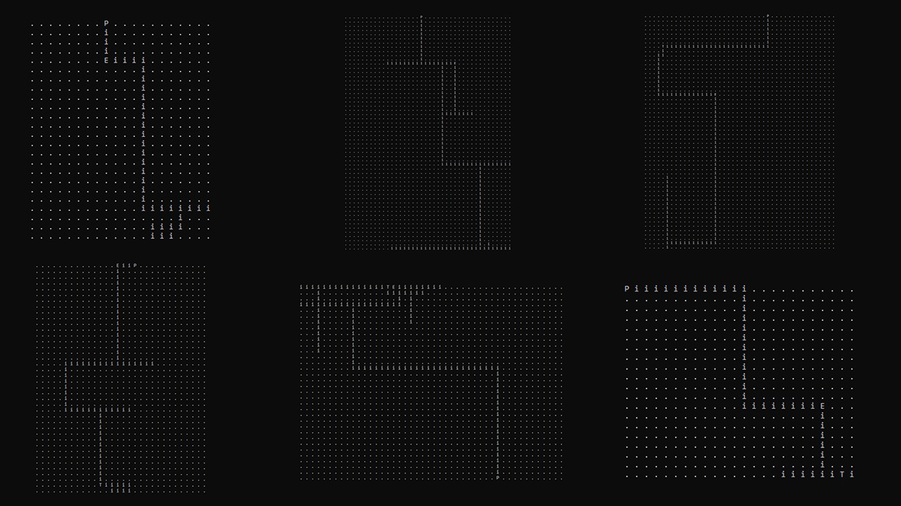

# ConsoleStepByStep

This is a step by step console game, where you might walk on map, fight with enemies and collect treasures.

It`s my learning project for proof and fixing my skills in basic C++ coding and design simple game mechanics. It`s not ideal and looks like skelet demo, but I do my major idea and basic mechanics.

```
You may download Execute archive for testing it.
```


## Entities and mechanics

Map
* Kind of container class which looks like 2D matrix, filled bits of the map - MapCell, and contains methods for work with map. On map placing: player, enemies and treasures.

Character
* BasicCharacter class is a skelet for Player and Enemy, he have: name, health, armour, damage, speed and "body list".
* BodyParts. For more interesting battle system - Character body consists of BodyParts, with: strength and hit chance.

Battle
* Cycle consists of 2 stages: attack and defence, for do both of them you need spend stamina points. You take more information if 
* Enemy select player body part by randomise of prefered BodyParts, contains in simple enemy behaviour pattern.

Game Mode
* Cycle consists of 2 parts: walk on the map and battle. Most game commands contains here.

Treasure
* Simple container class for convenient manage gold and collect items for Player (For realize last I just did not have time, sorry).


## Random map generating
I do simple random map generating, it`s happens like this:
1. Random start and exit positions on opposite map sections.
2. Random build main path from start to end map.
3. Random build turns.
4. Random placing treasure and enemy on map.

Most operations work with Directions[LEFT, RIGHT, UP, DOWN] and random numbers.




## What I learned

* C++ Basic & Core
* Debug in Microsoft Visual Studio C++
* (little bit) Cycle & algorithms design
* (little bit) Data structures
* 2D math
* Random level generating


## Future updates

* Adjust stability of random generating
* New fixed maps and enemy types
